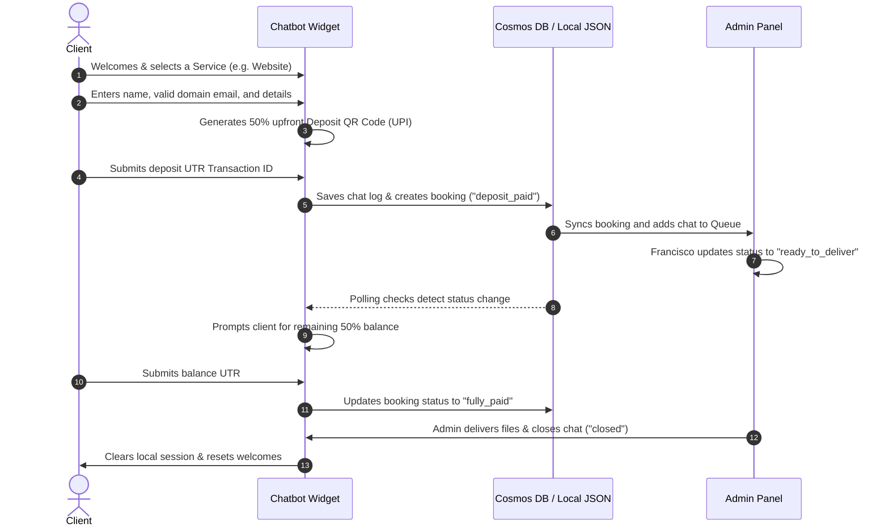
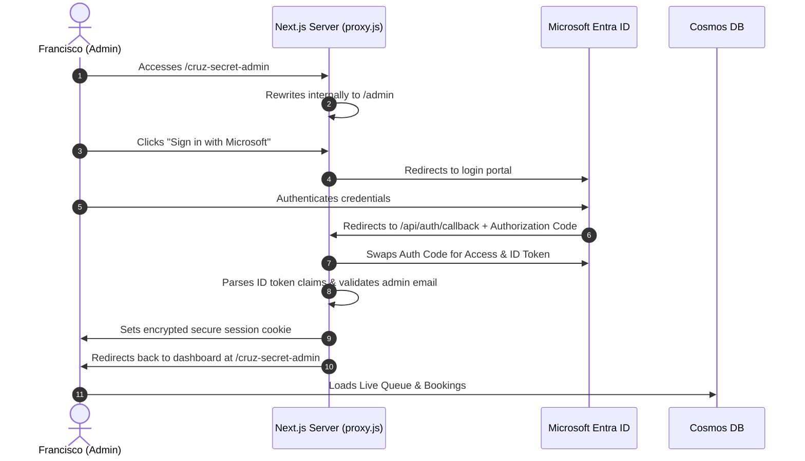

# 🚀 Cruz Dev | Premium Freelancer Portfolio & Booking PWA

A high-performance, responsive Progressive Web Application (PWA) built for **Francis Cruz**, showcasing creative services in Web Development, Poster Design, and YouTube Thumbnail Design. It features a custom AI-driven interactive booking chatbot, split-payment (50/50) processing, a real-time admin chat queue, Azure Cosmos DB integration, and secure SSO login via Microsoft Entra ID (Azure App Registration).

---

## 🛠️ Technology Stack & Versions

| Icon | Technology | Version | Purpose |
| :---: | :--- | :---: | :--- |
|  | **Next.js** | `16.2.7` | React Framework (using Turbopack & App Router) |
|  | **React** | `19.2.4` | Component-based UI Library |
|  | **Azure Cosmos DB** | `^4.9.3` | Scalable NoSQL database (using `@azure/cosmos` SDK) |
| 🛡️ | **Microsoft Entra ID** | *Native* | Azure Active Directory App Registration SSO Auth |
| 📱 | **PWA Configuration** | *Native* | Offline support, custom service worker, and app manifest |
| 🎨 | **Vanilla CSS** | *Native* | Rich glassmorphism aesthetics and custom CSS variables |
| 🔀 | **Next.js Proxy** | `16.2` | Advanced routing layer (`proxy.js`) for secret path rewrites |

---

## 📐 System Architecture

The application is engineered as a lightweight, zero-dependency, serverless PWA integrating client-side React with Next.js API Routes and Azure cloud storage.

```
                    ┌────────────────────────┐
                    │       Web Client       │
                    │  (Next.js PWA Front)   │
                    └───────────┬────────────┘
                                │
               (HTTP API / JSON / Cookies)
                                │
                                ▼
         ┌──────────────────────────────────────────────┐
         │              Next.js API Server              │
         │  (App Router API Endpoints & Request Proxy)  │
         └───────────────┬──────────────┬───────────────┘
                         │              │
        (Microsoft OAuth)│              │(Azure Cosmos SDK)
                         ▼              ▼
           ┌──────────────────┐   ┌───────────────────────────┐
           │Microsoft Entra ID│   │      Azure Cosmos DB      │
           │  (App Register)  │   │ ('Bookings' Container)    │
           └──────────────────┘   └───────────────────────────┘
```

### Key Components:
1. **PWA Layer**: Registered service worker (`sw.js`) and web app manifest for a native app-like experience (offline support, splash screens, mobile installation).
2. **Interactive Chatbot**: Custom customer assistant component that collects package orders, manages client info, displays QR codes, and synchronizes live transcripts.
3. **Internal Proxy (`proxy.js`)**: Intercepts requests on production to transparently rewrite a customizable secret route (`process.env.ADMIN_PATH`) to the admin panel while returning `404` for the default `/admin` path.
4. **Auth Helper**: Zero-dependency token decryption and session state encryption via Node's native `crypto` API (AES-256-CBC).

---

## 📊 Flow Diagrams

### 1. Customer Booking & Payment Flow


### 2. Secure Admin Authentication Flow


---

## 💼 Available Services

* 🌐 **Premium Freelance Websites**: Scalable Next.js frontends, responsive mobile layouts, and custom interactive dashboards.
* 🎨 **High-End Posters**: Glassmorphic, modern, and dark-themed promotional assets.
* 📺 **YouTube Thumbnails**: High-CTR, custom branded thumbnails featuring advanced typographic hierarchy.
* 💬 **Consultations & Advisory**: Custom packages tailored around user-specific blueprints.

---

## ⚡ Setup & Installation

### 1. Clone & Install Dependencies
```bash
git clone https://github.com/your-repo/freelance-portfolio-pwa.git
cd freelance-portfolio-pwa
npm install
```

### 2. Configure Environment Variables
Copy `.env.example` to create your local `.env.local` configuration:
```bash
cp .env.example .env.local
```
Populate `.env.local` with your database and Microsoft Entra ID parameters. Do **not** check this file into source control.


### 3. Run Development Server
```bash
npm run dev
```
Open [http://localhost:3000](http://localhost:3000) for the client app, or [http://localhost:3000/cruz-secret-admin](http://localhost:3000/cruz-secret-admin) for the admin portal.

---

## 📈 Future Additions & Roadmap

To further elevate the platform, the following features can be added next:
1. **SMTP Email Integration**:
   Connect real email dispatch software (e.g. Resend, Twilio SendGrid) to replace standard console logs with real email invoices and booking notifications sent directly to `ADMIN_EMAIL` and clients.
2. **Web Push Notification Alerts**:
   Integrate browser push notification APIs to alert the admin on their mobile device or desktop immediately when a new guest joins the live chat queue.
3. **PWA Offline Database Sync Queue**:
   Implement IndexedDB client-side logging so that if a customer loses internet connection while typing in the chatbot, the messages are queued locally and automatically sync back to Azure Cosmos DB when connection is restored.
4. **Chatbot Natural Language Processing (NLP)**:
   Integrate Azure OpenAI / Microsoft Semantic Kernel to enable intelligent, conversational answers to guest inquiries alongside the structured booking form steps.

## 👥 Author

### 👤 Francis Ponnu Cruz I
> **Azure Cloud & DevOps Engineer | Microsoft Certified Trainer (MCT)**

#### 🌐 Connect with Me:
[](https://github.com/ajf013)
[](https://www.linkedin.com/in/ajf013-francis-cruz/)
[](https://x.com/Itsme_Ajf013)
[](https://fcruz.org)
[](https://linktr.ee/AJF013)